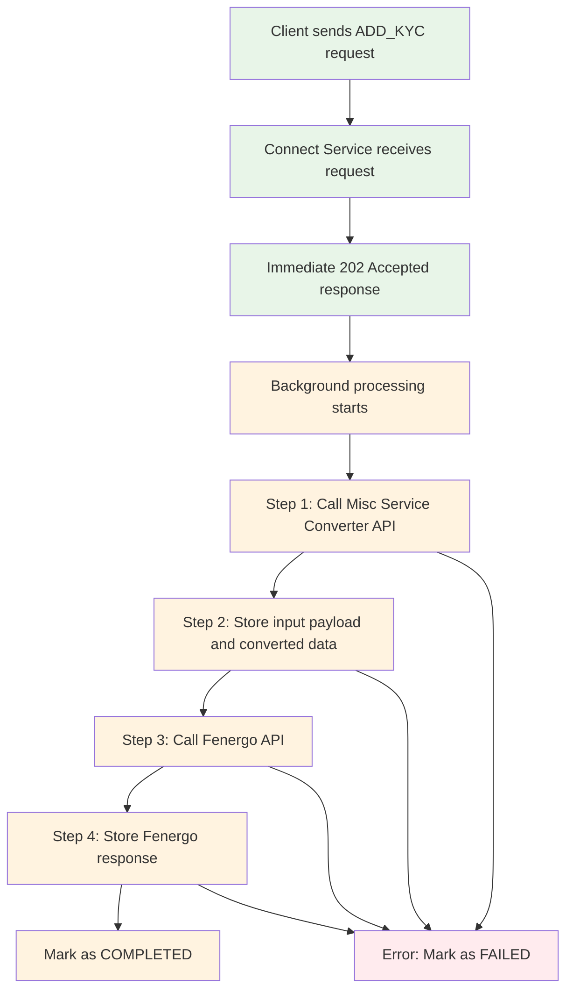

# ADD_KYC Implementation Guide

## Overview

This document explains the implementation of the ADD_KYC request type processing, which follows a specific 4-step synchronous workflow.

## Request Flow



## Implementation Details

### 1. **Request Type**
```java
public enum RequestType {
    ADD_KYC("add_kyc", "Add KYC Processing"),
    // ... other types
}
```

### 2. **KYC Processor**
```java
@Component
@RequestProcessor("KycProcessor")
public class KycProcessor {
    
    @ProcessRequestType(
        value = {RequestType.ADD_KYC},
        priority = 25,
        description = "Handles ADD_KYC requests with misc service conversion and Fenergo API calls"
    )
    public ProcessingRequest processAddKyc(ProcessingRequest request) {
        // Implementation here
    }
}
```

## Processing Steps

### **Step 1: Call Misc Service Converter API (Synchronous)**

**API Details:**
- **URL**: `/api/v1/misc/service/converter`
- **Method**: GET
- **Input**: XML payload + request type + metadata
- **Output**: JSON data

**Implementation:**
```java
private String callMiscServiceConverter(ProcessingRequest request) {
    String miscServiceUrl = externalApiClient.getMiscServiceUrl() + "/api/v1/misc/service/converter";
    
    String response = restTemplate.getForObject(
        miscServiceUrl + "?requestType={requestType}&payload={payload}&requestId={requestId}&clientId={clientId}",
        String.class,
        request.getRequestType().getCode(),
        request.getOriginalPayload(),
        request.getRequestId(),
        request.getClientId()
    );
    
    return response;
}
```

**Request Parameters:**
- `requestType`: "add_kyc"
- `payload`: XML data from client
- `requestId`: Unique processing ID
- `clientId`: Client identifier
- `metadata`: Optional additional data

### **Step 2: Store Input Payload and Converted Data**

**Storage:**
- **Input Payload**: Stored in `originalPayload` field
- **Converted Data**: Stored in `convertedJsonPayload` field
- **Tracking**: Uses `requestId` for future reference

**Implementation:**
```java
ProcessingRequest updatedRequest = request.toBuilder()
        .status(ProcessingStatus.PROCESSING)
        .processingStartTime(LocalDateTime.now())
        .convertedJsonPayload(convertedJsonData)
        .metadata(addKycMetadata(request.getMetadata()))
        .build();
```

### **Step 3: Call Fenergo API**

**API Details:**
- **URL**: Configurable Fenergo API endpoint
- **Method**: POST
- **Input**: Converted JSON data from Step 1
- **Authentication**: OAuth2 Bearer token

**Implementation:**
```java
private String callFenergoApi(String convertedJsonData, ProcessingRequest request) {
    Map<String, Object> fenergoRequest = new HashMap<>();
    fenergoRequest.put("requestId", request.getRequestId());
    fenergoRequest.put("requestType", request.getRequestType().getCode());
    fenergoRequest.put("convertedData", convertedJsonData);
    fenergoRequest.put("clientId", request.getClientId());
    fenergoRequest.put("timestamp", LocalDateTime.now().toString());
    
    String fenergoResponse = fenergoApiClient.callFenergoApi(fenergoRequest);
    return fenergoResponse;
}
```

### **Step 4: Store Fenergo Response**

**Storage:**
- **Fenergo Response**: Stored in `fenergoResponse` field
- **Status**: Updated to `COMPLETED`
- **Timestamps**: `processingEndTime` and `updatedAt` set

**Implementation:**
```java
ProcessingRequest finalRequest = updatedRequest.toBuilder()
        .fenergoResponse(fenergoResponse)
        .status(ProcessingStatus.COMPLETED)
        .processingEndTime(LocalDateTime.now())
        .updatedAt(LocalDateTime.now())
        .build();
```

## Error Handling

### **Step-Level Error Handling**
Each step has its own error handling:

```java
try {
    // Step processing
    String result = processStep();
    return result;
} catch (Exception e) {
    log.error("Step failed for request: {}", request.getRequestId(), e);
    throw new RuntimeException("Step failed: " + e.getMessage(), e);
}
```

### **Overall Error Handling**
If any step fails, the entire process is marked as failed:

```java
catch (Exception error) {
    log.error("ADD_KYC processing failed for request: {}", request.getRequestId(), error);
    
    return request.toBuilder()
            .status(ProcessingStatus.FAILED)
            .errorMessage(error.getMessage())
            .stackTrace(getStackTrace(error))
            .processingEndTime(LocalDateTime.now())
            .updatedAt(LocalDateTime.now())
            .build();
}
```

## Configuration

### **External Services Configuration**
```yaml
external:
  services:
    misc-service:
      base-url: ${MISC_SERVICE_URL:http://localhost:8081}
      timeout: 30000
      retry-attempts: 3
    fenergo:
      base-url: ${FENERGO_SERVICE_URL:https://api.fenergo.com}
      timeout: 60000
      retry-attempts: 3
      api-path: ${FENERGO_API_PATH:/api/v1/kyc}
```

### **OAuth2 Configuration**
```yaml
spring:
  security:
    oauth2:
      client:
        registration:
          fenergo:
            client-id: ${FENERGO_CLIENT_ID:default-fenergo-client}
            client-secret: ${FENERGO_CLIENT_SECRET:default-fenergo-secret}
            authorization-grant-type: client_credentials
            scope: api
        provider:
          fenergo:
            token-uri: ${FENERGO_TOKEN_URI:https://api.fenergo.com/oauth/token}
```

## API Usage

### **Request Example**
```bash
POST /api/v1/connect/process
Content-Type: application/json

{
  "requestType": "ADD_KYC",
  "payload": "<kyc><customer><name>John Doe</name><id>12345</id></customer></kyc>",
  "contentType": "application/xml",
  "clientId": "client-123",
  "requestId": "req-kyc-001",
  "metadata": {
    "customerId": "12345",
    "kycType": "individual",
    "priority": "high"
  }
}
```

### **Immediate Response**
```json
{
  "requestId": "req-kyc-001",
  "status": "ACCEPTED",
  "message": "Request accepted for processing (annotation-based)",
  "timestamp": "2024-01-01T12:00:00",
  "processingId": "proc-kyc-789012"
}
```

### **Status Check**
```bash
GET /api/v1/connect/status/req-kyc-001
```

### **Status Response (Completed)**
```json
{
  "requestId": "req-kyc-001",
  "status": "COMPLETED",
  "message": "Processing completed successfully",
  "timestamp": "2024-01-01T12:05:00",
  "processingId": "proc-kyc-789012",
  "data": {
    "originalPayload": "<kyc><customer><name>John Doe</name><id>12345</id></customer></kyc>",
    "convertedJsonPayload": "{\"customer\":{\"name\":\"John Doe\",\"id\":\"12345\"}}",
    "fenergoResponse": "{\"status\":\"success\",\"kycId\":\"kyc-12345\"}",
    "retryCount": 0,
    "createdAt": "2024-01-01T12:00:00",
    "updatedAt": "2024-01-01T12:05:00"
  }
}
```

### **Status Response (Failed)**
```json
{
  "requestId": "req-kyc-001",
  "status": "FAILED",
  "message": "Processing failed",
  "timestamp": "2024-01-01T12:03:00",
  "processingId": "proc-kyc-789012",
  "error": {
    "message": "Misc service converter API call failed: Connection timeout",
    "details": "java.net.SocketTimeoutException: Read timed out..."
  }
}
```

## Database Schema

### **ProcessingRequest Document**
```json
{
  "_id": "proc-kyc-789012",
  "requestId": "req-kyc-001",
  "requestType": "ADD_KYC",
  "originalPayload": "<kyc>...</kyc>",
  "convertedJsonPayload": "{\"customer\":...}",
  "fenergoResponse": "{\"status\":\"success\"...}",
  "status": "COMPLETED",
  "clientId": "client-123",
  "priority": 5,
  "timeoutMs": 300000,
  "metadata": {
    "processType": "add_kyc",
    "requiresMiscServiceConversion": true,
    "requiresFenergoApiCall": true,
    "processor": "KycProcessor",
    "processingSteps": [
      "misc_service_conversion",
      "data_storage",
      "fenergo_api_call",
      "response_storage"
    ]
  },
  "createdAt": "2024-01-01T12:00:00",
  "updatedAt": "2024-01-01T12:05:00",
  "processingStartTime": "2024-01-01T12:00:01",
  "processingEndTime": "2024-01-01T12:05:00"
}
```

## Monitoring and Logging

### **Log Messages**
```
2024-01-01 12:00:00 [INFO] Processing ADD_KYC request: req-kyc-001
2024-01-01 12:00:01 [INFO] Step 1: Calling misc service converter API for request: req-kyc-001
2024-01-01 12:00:02 [INFO] Step 1 completed: Misc service conversion successful for request: req-kyc-001
2024-01-01 12:00:03 [INFO] Step 2: Storing input payload and converted data for request: req-kyc-001
2024-01-01 12:00:04 [INFO] Step 3: Calling Fenergo API for request: req-kyc-001
2024-01-01 12:00:05 [INFO] Step 4: Storing Fenergo response for request: req-kyc-001
2024-01-01 12:00:06 [INFO] ADD_KYC processing completed successfully for request: req-kyc-001
```

### **Error Logging**
```
2024-01-01 12:00:02 [ERROR] Failed to call misc service converter API for request: req-kyc-001
2024-01-01 12:00:03 [ERROR] ADD_KYC processing failed for request: req-kyc-001
```

## Testing

### **Unit Test Example**
```java
@Test
void shouldProcessAddKycRequest() {
    // Given
    ProcessingRequest request = createAddKycRequest();
    when(restTemplate.getForObject(anyString(), eq(String.class), any()))
        .thenReturn("{\"converted\":\"data\"}");
    when(fenergoApiClient.callFenergoApi(any()))
        .thenReturn("{\"status\":\"success\"}");
    
    // When
    ProcessingRequest result = kycProcessor.processAddKyc(request);
    
    // Then
    assertThat(result.getStatus()).isEqualTo(ProcessingStatus.COMPLETED);
    assertThat(result.getConvertedJsonPayload()).isNotNull();
    assertThat(result.getFenergoResponse()).isNotNull();
}
```

### **Integration Test Example**
```java
@Test
void shouldProcessAddKycEndToEnd() {
    // Given
    ConnectRequestDto request = createAddKycRequestDto();
    
    // When
    CompletableFuture<ConnectResponseDto> response = connectService.processRequestAsync(request);
    
    // Then
    ConnectResponseDto result = response.get();
    assertThat(result.getStatus()).isEqualTo("ACCEPTED");
    
    // Wait for processing to complete
    Thread.sleep(5000);
    
    // Check final status
    ConnectResponseDto status = connectService.getRequestStatus(result.getRequestId());
    assertThat(status.getStatus()).isEqualTo("COMPLETED");
}
```

## Security Considerations

### **Authentication**
- **Incoming Requests**: Authenticated via Apigee Gateway
- **Misc Service**: No authentication required (internal service)
- **Fenergo API**: OAuth2 Bearer token authentication

### **Data Protection**
- All data encrypted in transit (HTTPS)
- Sensitive data encrypted at rest in MongoDB
- No sensitive data in logs

### **Error Handling**
- No sensitive information exposed in error messages
- Detailed error logging for debugging
- Proper error categorization

## Performance Considerations

### **Timeouts**
- **Misc Service**: 30 seconds
- **Fenergo API**: 60 seconds
- **Overall Processing**: 5 minutes

### **Retry Logic**
- **Misc Service**: 3 retry attempts
- **Fenergo API**: 3 retry attempts
- **Exponential backoff**: 1s, 2s, 4s delays

### **Monitoring**
- Processing time metrics
- Success/failure rates
- External API response times
- Error rates by step

## Summary

The ADD_KYC implementation provides:

1. **Synchronous Processing** - Step 1 (misc service) is synchronous
2. **Comprehensive Tracking** - All data stored with unique request ID
3. **Robust Error Handling** - Failed steps are properly logged and tracked
4. **Flexible Configuration** - External service URLs and timeouts configurable
5. **Complete Audit Trail** - All processing steps and responses stored
6. **Easy Monitoring** - Detailed logging and status tracking

**Ready for production use!** 🚀
