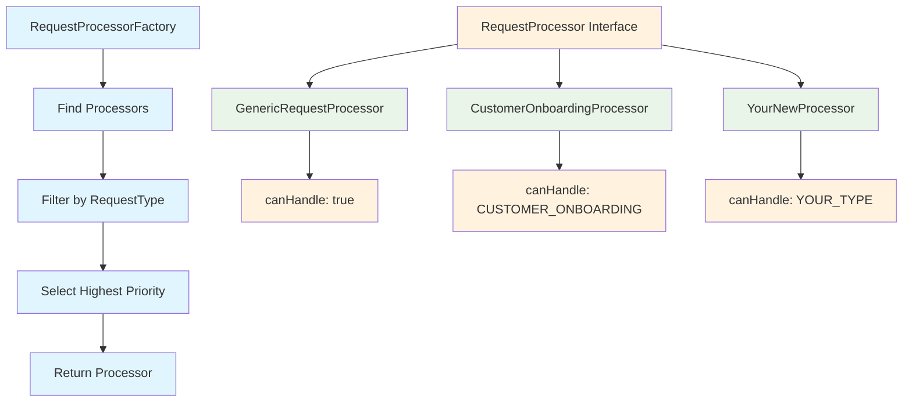

# RequestProcessorFactory - How to Create New Processors

## Overview

The `RequestProcessorFactory` is a key component that uses the **Factory Pattern** and **Strategy Pattern** to create appropriate request processors based on the request type. This makes the system highly extensible - you can easily add new processors for different types of requests without modifying existing code.

## How It Works

### 1. **Factory Pattern**
The factory automatically discovers all `RequestProcessor` implementations and creates a registry of them.

### 2. **Strategy Pattern**
Each processor implements a specific strategy for handling a particular type of request.

### 3. **Priority-Based Selection**
When multiple processors can handle the same request type, the one with the highest priority is selected.

## Architecture



## Current Processors

### 1. **GenericRequestProcessor**
- **Handles**: All request types (fallback)
- **Priority**: 0 (lowest)
- **Purpose**: Default processor for any request type

### 2. **CustomerOnboardingProcessor**
- **Handles**: `CUSTOMER_ONBOARDING` requests
- **Priority**: 10 (higher than generic)
- **Purpose**: Specialized processing for customer onboarding

## How to Create a New Processor

### Step 1: Create the Processor Class

```java
package com.adyanta.connect.processing.processors;

import com.adyanta.connect.domain.document.ProcessingRequest;
import com.adyanta.connect.domain.enums.ProcessingStatus;
import com.adyanta.connect.domain.enums.RequestType;
import com.adyanta.connect.processing.ProcessingPipeline;
import com.adyanta.connect.processing.RequestProcessor;
import lombok.RequiredArgsConstructor;
import lombok.extern.slf4j.Slf4j;
import org.springframework.stereotype.Component;
import reactor.core.publisher.Mono;

import java.time.LocalDateTime;

/**
 * Your custom processor for specific request type
 */
@Slf4j
@Component
@RequiredArgsConstructor
public class YourCustomProcessor implements RequestProcessor {
    
    private final ProcessingPipeline processingPipeline;
    
    @Override
    public boolean canHandle(RequestType requestType) {
        // Define which request type this processor handles
        return requestType == RequestType.YOUR_CUSTOM_TYPE;
    }
    
    @Override
    public String getName() {
        return "YourCustomProcessor";
    }
    
    @Override
    public int getPriority() {
        // Higher number = higher priority
        // Generic processor has priority 0
        return 20; // This processor will be chosen over generic
    }
    
    @Override
    public Mono<ProcessingRequest> process(ProcessingRequest request) {
        log.info("Processing with custom processor: {}", request.getRequestId());
        
        // Add custom preprocessing logic here
        ProcessingRequest customRequest = addCustomMetadata(request);
        
        // Use the standard processing pipeline
        return processingPipeline.execute(customRequest)
                .doOnSuccess(result -> log.info("Custom processing completed: {}", request.getRequestId()))
                .doOnError(error -> log.error("Custom processing failed: {}", request.getRequestId(), error));
    }
    
    private ProcessingRequest addCustomMetadata(ProcessingRequest request) {
        return request.toBuilder()
                .status(ProcessingStatus.PROCESSING)
                .processingStartTime(LocalDateTime.now())
                .metadata(addCustomFields(request.getMetadata()))
                .build();
    }
    
    private java.util.Map<String, Object> addCustomFields(java.util.Map<String, Object> existingMetadata) {
        if (existingMetadata == null) {
            existingMetadata = new java.util.HashMap<>();
        }
        existingMetadata.put("processorType", "custom");
        existingMetadata.put("customField", "customValue");
        return existingMetadata;
    }
}
```

### Step 2: Add New Request Type (if needed)

```java
// In RequestType enum
public enum RequestType {
    GENERIC_PROCESSING,
    CUSTOMER_ONBOARDING,
    YOUR_CUSTOM_TYPE,  // Add your new type here
    // ... other types
}
```

### Step 3: The Factory Automatically Discovers Your Processor

The factory uses Spring's dependency injection to automatically find all `RequestProcessor` implementations. No additional configuration needed!

## Processor Selection Logic

```java
public RequestProcessor getProcessor(RequestType requestType) {
    // 1. Find all processors that can handle this request type
    Optional<RequestProcessor> processor = processors.stream()
            .filter(p -> p.canHandle(requestType))
            .max((p1, p2) -> Integer.compare(p1.getPriority(), p2.getPriority()));
    
    // 2. If found, return the highest priority processor
    if (processor.isPresent()) {
        return processor.get();
    }
    
    // 3. Fallback to generic processor
    Optional<RequestProcessor> genericProcessor = processors.stream()
            .filter(p -> p.canHandle(RequestType.GENERIC_PROCESSING))
            .findFirst();
    
    if (genericProcessor.isPresent()) {
        return genericProcessor.get();
    }
    
    // 4. Throw exception if no processor found
    throw new IllegalArgumentException("No processor found for request type: " + requestType);
}
```

## Priority System

| Processor | Priority | Handles | Selection Order |
|-----------|----------|---------|-----------------|
| YourCustomProcessor | 20 | YOUR_CUSTOM_TYPE | 1st (highest) |
| CustomerOnboardingProcessor | 10 | CUSTOMER_ONBOARDING | 2nd |
| GenericRequestProcessor | 0 | All types | 3rd (fallback) |

## Example: Creating a Payment Processor

### 1. **Create PaymentProcessor**

```java
@Component
public class PaymentProcessor implements RequestProcessor {
    
    @Override
    public boolean canHandle(RequestType requestType) {
        return requestType == RequestType.PAYMENT_PROCESSING;
    }
    
    @Override
    public String getName() {
        return "PaymentProcessor";
    }
    
    @Override
    public int getPriority() {
        return 15; // Higher than customer onboarding
    }
    
    @Override
    public Mono<ProcessingRequest> process(ProcessingRequest request) {
        log.info("Processing payment request: {}", request.getRequestId());
        
        // Add payment-specific validation
        validatePaymentRequest(request);
        
        // Add payment metadata
        ProcessingRequest paymentRequest = request.toBuilder()
                .status(ProcessingStatus.PROCESSING)
                .processingStartTime(LocalDateTime.now())
                .metadata(addPaymentMetadata(request.getMetadata()))
                .build();
        
        return processingPipeline.execute(paymentRequest);
    }
    
    private void validatePaymentRequest(ProcessingRequest request) {
        // Add payment-specific validation logic
        if (request.getMetadata() == null || 
            !request.getMetadata().containsKey("paymentAmount")) {
            throw new IllegalArgumentException("Payment amount is required");
        }
    }
    
    private Map<String, Object> addPaymentMetadata(Map<String, Object> existingMetadata) {
        if (existingMetadata == null) {
            existingMetadata = new HashMap<>();
        }
        existingMetadata.put("processorType", "payment");
        existingMetadata.put("requiresFraudCheck", true);
        existingMetadata.put("requiresCompliance", true);
        return existingMetadata;
    }
}
```

### 2. **Add Request Type**

```java
public enum RequestType {
    GENERIC_PROCESSING,
    CUSTOMER_ONBOARDING,
    PAYMENT_PROCESSING,  // New type
    // ... other types
}
```

### 3. **Usage**

```java
// The factory automatically selects PaymentProcessor for PAYMENT_PROCESSING requests
RequestProcessor processor = factory.getProcessor(RequestType.PAYMENT_PROCESSING);
ProcessingRequest result = processor.process(request);
```

## Testing Your Processor

### 1. **Unit Test**

```java
@ExtendWith(MockitoExtension.class)
class YourCustomProcessorTest {
    
    @Mock
    private ProcessingPipeline processingPipeline;
    
    @InjectMocks
    private YourCustomProcessor processor;
    
    @Test
    void shouldHandleCustomRequestType() {
        // Given
        RequestType requestType = RequestType.YOUR_CUSTOM_TYPE;
        
        // When
        boolean canHandle = processor.canHandle(requestType);
        
        // Then
        assertTrue(canHandle);
    }
    
    @Test
    void shouldHaveCorrectPriority() {
        // When
        int priority = processor.getPriority();
        
        // Then
        assertEquals(20, priority);
    }
    
    @Test
    void shouldProcessRequest() {
        // Given
        ProcessingRequest request = createTestRequest();
        ProcessingRequest expectedResult = createExpectedResult();
        
        when(processingPipeline.execute(any())).thenReturn(Mono.just(expectedResult));
        
        // When
        Mono<ProcessingRequest> result = processor.process(request);
        
        // Then
        StepVerifier.create(result)
                .expectNext(expectedResult)
                .verifyComplete();
    }
}
```

### 2. **Integration Test**

```java
@SpringBootTest
class ProcessorFactoryIntegrationTest {
    
    @Autowired
    private RequestProcessorFactory factory;
    
    @Test
    void shouldSelectCustomProcessor() {
        // Given
        RequestType requestType = RequestType.YOUR_CUSTOM_TYPE;
        
        // When
        RequestProcessor processor = factory.getProcessor(requestType);
        
        // Then
        assertThat(processor).isInstanceOf(YourCustomProcessor.class);
        assertThat(processor.getName()).isEqualTo("YourCustomProcessor");
    }
}
```

## Best Practices

### 1. **Naming Convention**
- Use descriptive names: `PaymentProcessor`, `DocumentProcessor`
- End with `Processor`: `YourCustomProcessor`

### 2. **Priority Guidelines**
- **0-9**: Generic/fallback processors
- **10-19**: Standard business processors
- **20-29**: Specialized processors
- **30+**: High-priority processors

### 3. **Error Handling**
- Always handle errors gracefully
- Log errors with context
- Update request status appropriately

### 4. **Metadata Management**
- Add processor-specific metadata
- Don't overwrite existing metadata
- Use consistent field names

### 5. **Logging**
- Log at appropriate levels
- Include request ID in logs
- Log processing start/completion

## Common Patterns

### 1. **Validation Processor**
```java
@Override
public Mono<ProcessingRequest> process(ProcessingRequest request) {
    // Validate request
    validateRequest(request);
    
    // Process with pipeline
    return processingPipeline.execute(request);
}
```

### 2. **Enrichment Processor**
```java
@Override
public Mono<ProcessingRequest> process(ProcessingRequest request) {
    // Enrich with additional data
    ProcessingRequest enrichedRequest = enrichRequest(request);
    
    // Process with pipeline
    return processingPipeline.execute(enrichedRequest);
}
```

### 3. **Conditional Processor**
```java
@Override
public boolean canHandle(RequestType requestType) {
    return requestType == RequestType.SPECIFIC_TYPE && 
           someConditionIsMet();
}
```

## Troubleshooting

### 1. **Processor Not Found**
- Check if `@Component` annotation is present
- Verify `canHandle()` method logic
- Check package scanning configuration

### 2. **Wrong Processor Selected**
- Check priority values
- Verify `canHandle()` method logic
- Check for multiple processors handling same type

### 3. **Processing Fails**
- Check error logs
- Verify pipeline configuration
- Check external service connectivity

## Summary

The `RequestProcessorFactory` makes it easy to add new processors:

1. **Create** a new processor class implementing `RequestProcessor`
2. **Add** `@Component` annotation
3. **Implement** required methods
4. **Set** appropriate priority
5. **Test** your implementation

The factory automatically discovers and uses your new processor! 🚀
