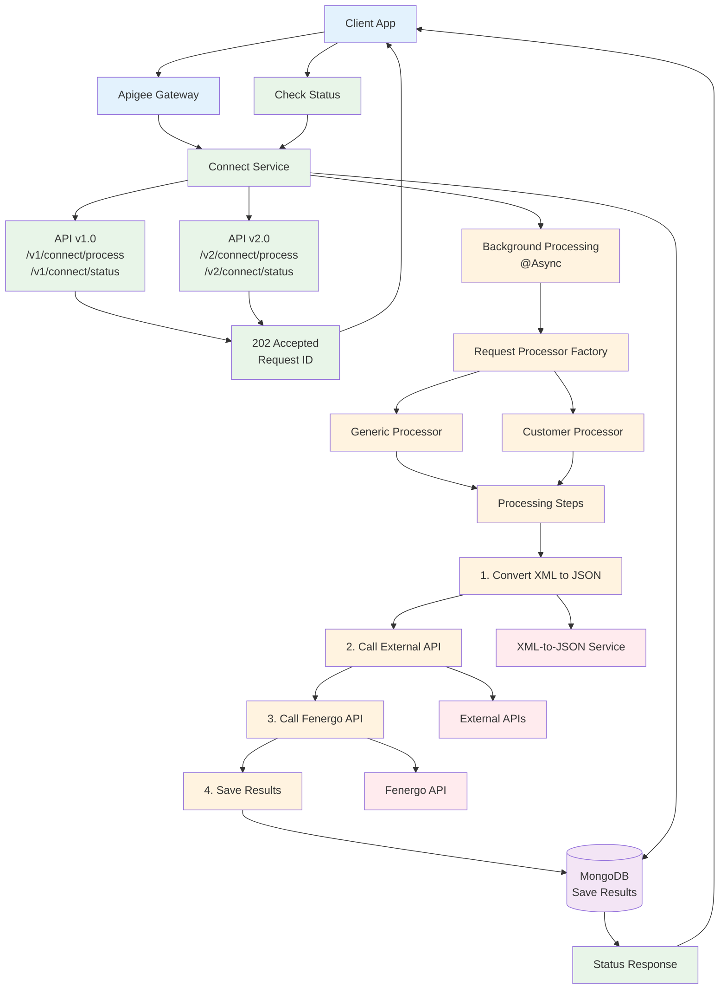

# Connect Service - Simple Architecture

## Overview
A simple diagram showing how the Connect Service works from API request to completion.

## Simple Architecture Diagram



## How It Works (Simple)

### 1. **Client Sends Request**
```
Client → Apigee Gateway → Connect Service
```

### 2. **Immediate Response**
```
Connect Service → 202 Accepted → Client (with Request ID)
```

### 3. **Background Processing**
```
Connect Service → Factory → Processor → Steps → External Services → Database
```

### 4. **Check Status**
```
Client → Connect Service → Database → Status Response
```

## API Endpoints

### **Process Request**
- `POST /v1/connect/process` - Process XML/JSON (v1.0)
- `POST /v2/connect/process` - Process XML/JSON (v2.0)

### **Check Status**
- `GET /v1/connect/status/{requestId}` - Get status (v1.0)
- `GET /v2/connect/status/{requestId}` - Get status (v2.0)

### **Health Check**
- `GET /v1/connect/health` - Health check (v1.0)
- `GET /v2/connect/health` - Health check (v2.0)

## Processing Steps

### **Step 1: Convert XML to JSON**
- Takes XML input
- Calls XML-to-JSON service
- Returns JSON

### **Step 2: Call External API**
- Takes JSON from Step 1
- Calls external API
- Returns response

### **Step 3: Call Fenergo API**
- Takes response from Step 2
- Calls Fenergo API
- Returns Fenergo response

### **Step 4: Save Results**
- Saves all data to MongoDB
- Updates status to COMPLETED

## Key Features

### **Fire-and-Forget**
- Client gets immediate response
- Processing happens in background
- Client can check status later

### **Async Processing**
- Uses `@Async` for background work
- Multiple thread pools for different tasks
- Handles errors gracefully

### **Factory Pattern**
- Different processors for different request types
- Easy to add new request types
- Clean separation of concerns

### **Chain of Responsibility**
- Processing steps are chained together
- Each step does one thing
- Easy to add/remove steps

## Error Handling

### **If Step Fails**
1. Log the error
2. Update status to FAILED
3. Save error message
4. Client can check status to see error

### **Retry Logic**
- Automatic retry for temporary failures
- Maximum retry attempts
- Exponential backoff

## Monitoring

### **Health Checks**
- Service health
- Database connectivity
- External service status

### **Metrics**
- Request count
- Success rate
- Processing time
- Error rate

### **Logs**
- Request tracking
- Error details
- Processing steps

## Security

### **Authentication**
- Apigee Gateway handles client authentication
- OAuth2 for external service calls
- Vault for secure secret storage

### **Data Protection**
- SSL/TLS encryption
- Secure database connections
- Encrypted secrets

## That's It!

The Connect Service is simple:
1. **Receive** request
2. **Respond** immediately
3. **Process** in background
4. **Save** results
5. **Check** status anytime

Easy to understand, easy to maintain, easy to extend! 🚀
